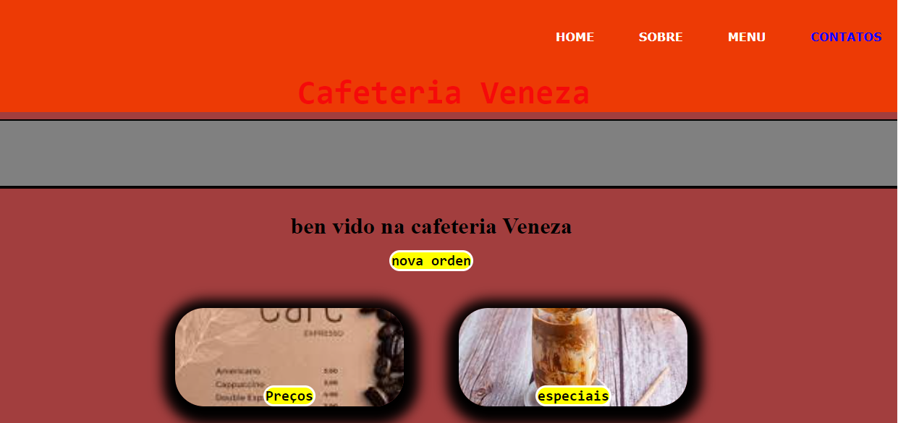

 
 Esse trabalho foi feito pra um cardapio de uma cafeteria de uma familia estrangera da venezuela ond evenden café e lanches tradicionais da sua cidade 

## ELEMENTOS  
* HTML
* CSS
* IMAGEN
pra ajudar os clientes pra fazer seus pedidos foi feito esse site com o cardapio, o especial da casa, e variedades de café.

## linguagens usadas 
* buttom
* h1,h2..
* nav
* ul
* footer
* hearder

## TECNOLOGIAS USADAS 

 